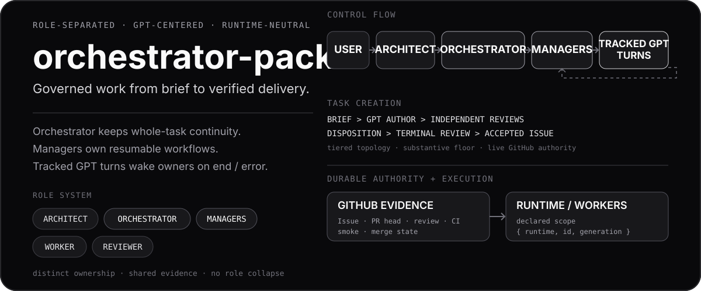

<p align="center">
  
</p>

`orchestrator-pack` is a governance layer for autonomous software work. It turns a task idea into a reviewed GitHub Issue, drives implementation and review through tracked ChatGPT turns, and treats only GitHub evidence (Issue, PR head, review, CI, smoke) as proof that the work is done.

The concrete agent runtime can be replaced; the task, review, and evidence contracts stay the same.

```text
[Operator] --> [Orchestrator] --> [Manager] --> [ChatGPT turn]
                keeps the task     owns one         authors, reviews,
                alive, recovers    workflow         implements
                                       |
                                       v
                              [GitHub evidence]
                     Issue - PR head - review - CI - smoke
```

## Why it is different

- **Separate roles.** Orchestrator, manager, worker, and reviewer each own a distinct part of the work instead of one agent doing everything.
- **Reviewed tasks.** Every task is a GitHub Issue that passes independent GPT review before anyone implements it.
- **ChatGPT as a tracked transport.** Each GPT turn is recorded, can be resumed after a failure, and is never blindly re-sent.
- **Automatic wakeups.** When a GPT turn finishes or stalls, the workflow that owns it is woken up — no human needs to watch the browser.
- **GitHub is the truth.** What the chat says is advisory; progress is decided by the live Issue/PR state, current-head CI, and review.
- **Runtime-neutral.** Effects go through a registered runtime adapter (Orca today) and an exact runtime identity.

## Roles

| Role | Responsibility |
| --- | --- |
| **Orchestrator** | Keeps the whole task alive, launches managers, recovers from failures. |
| **Manager** | Owns one resumable workflow end to end: create an Issue, execute it, or review a PR. |
| **Worker** | Implements one bounded change within the declared scope. |
| **Reviewer** | Independently reviews the task or the PR and publishes findings. |
| **Architect** | One-off design and specification help. |

## Main workflows

| Skill | Use it to |
| --- | --- |
| [`create-issue-draft`](.cursor/skills/create-issue-draft/SKILL.md) | Turn a brief into an accepted Issue (GPT author + independent reviews, depth by [tier](docs/tiering.md)). |
| [`execute-issue-with-gpt`](.cursor/skills/execute-issue-with-gpt/SKILL.md) | Implement an accepted Issue through GPT, then drive the PR through review, CI, and smoke. |
| [`review-pr-with-gpt`](.cursor/skills/review-pr-with-gpt/SKILL.md) | Review an existing PR on its current head. |
| [`discuss-with-gpt`](.cursor/skills/discuss-with-gpt/SKILL.md) | Challenge a draft or idea with GPT. |

Merge is never the implementer's decision: it requires operator authority.

## Start here

Requirements:

- Node **24.x** and npm **11.x** as declared by [`scripts/toolchain/node-version.json`](scripts/toolchain/node-version.json)
- Git 2.25+
- authenticated GitHub transport
- the runtime, agent, reviewer, and Browser-GPT capabilities your workflow needs

Install and verify:

```bash
npm ci --include=dev
npm run check:node-major
npm run check:npm-major
node --experimental-strip-types scripts/verify.ts --strict-prereqs
node --experimental-strip-types scripts/verify.ts --reusable-only
```

Full development check:

```bash
npm run typecheck:foundation
npm run lint:foundation
npm run test:foundation
npm run gate-runner-selftest
node --experimental-strip-types scripts/runtime-retirement/retired-surface-selftest.ts
node --experimental-strip-types scripts/verify.ts
```

To use the pack with another repository, see [`docs/target_repo_setup.md`](docs/target_repo_setup.md).

## Documentation

README is an overview; the documents below are authoritative.

- [`AGENTS.md`](AGENTS.md) — project policy, edit boundaries, merge rules
- [`docs/orchestration-runbook.md`](docs/orchestration-runbook.md) — orchestrator, manager, and worker lifecycle
- [`docs/browser-gpt-turn-runbook.md`](docs/browser-gpt-turn-runbook.md) — one tracked ChatGPT turn
- [`docs/chatgpt-task-execution-runbook.md`](docs/chatgpt-task-execution-runbook.md) — multi-turn Issue execution through GPT
- [`docs/tiering.md`](docs/tiering.md) — task complexity tiers
- [`docs/repository_policy.md`](docs/repository_policy.md) — scope and reusable-content policy
- [`docs/target_repo_setup.md`](docs/target_repo_setup.md) — deploying into a target repository
- [`docs/migration_notes.md`](docs/migration_notes.md) — operator adoption notes

Code: [`plugins/`](plugins) (task declaration, scope guard, accounting, review), [`scripts/runtime/`](scripts/runtime) (runtime adapter contracts), [`scripts/fleet/`](scripts/fleet) (wakeups), [`.github/workflows/`](.github/workflows) (CI).
